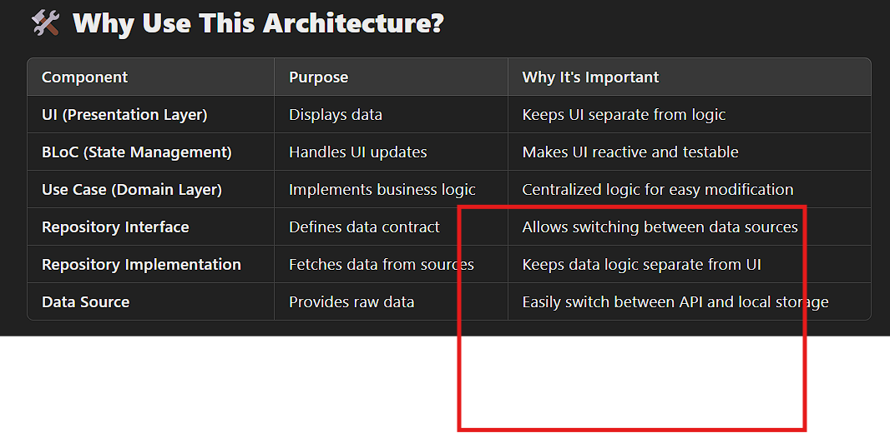
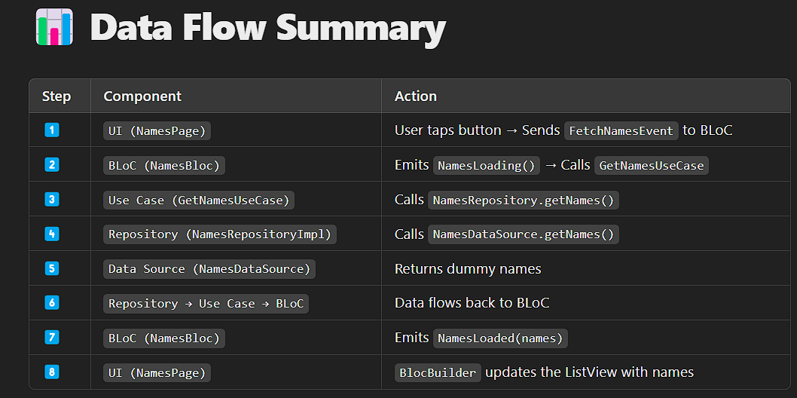

what is purpose of Purpose of Each Component in Clean Architecture:

1️⃣ Presentation Layer (UI & BLoC)
📂 features/names/presentation/

Purpose: Displays data and responds to user interactions.
Why? Separates UI logic from business logic for a cleaner and more reusable UI.
🔹 Components:

UI (names_page.dart) → Displays the names list.
BLoC (names_bloc.dart) → Handles events and state management.
Event (names_event.dart) → Represents user actions (e.g., FetchNamesEvent).
State (names_state.dart) → Represents UI states (e.g., Loading, Loaded).
📌 Example:

If the user taps a button, an event is sent to the BLoC, which processes the request and updates the UI.

2️⃣ Domain Layer (Business Logic)
📂 features/names/domain/

Purpose: Contains core business logic (rules & use cases).
Why? Keeps the logic independent of UI or data sources.
🔹 Components:

Entity (name_entity.dart) → Defines the structure of a name.
Repository Interface (names_repository.dart) → Abstract class for data fetching.
Use Case (get_names_usecase.dart) → Business logic to fetch names.
📌 Example:

The UI should not know where the data comes from (API, database, or local storage). The Use Case ensures that the UI only interacts with the business logic.

3️⃣ Data Layer (Fetching & Storing Data)
📂 features/names/data/

Purpose: Provides data (either from an API, database, or dummy data).
Why? This allows switching between data sources without changing business logic.
🔹 Components:

Model (name_model.dart) → Converts raw data (e.g., JSON) into a structured format.
Data Source (names_data_source.dart) → Provides data (e.g., API or dummy data).
Repository Implementation (names_repository_impl.dart) → Fetches data from the source.
📌 Example:

Right now, the app is using dummy data. Later, we can replace it with an API without changing the UI or business logic.

